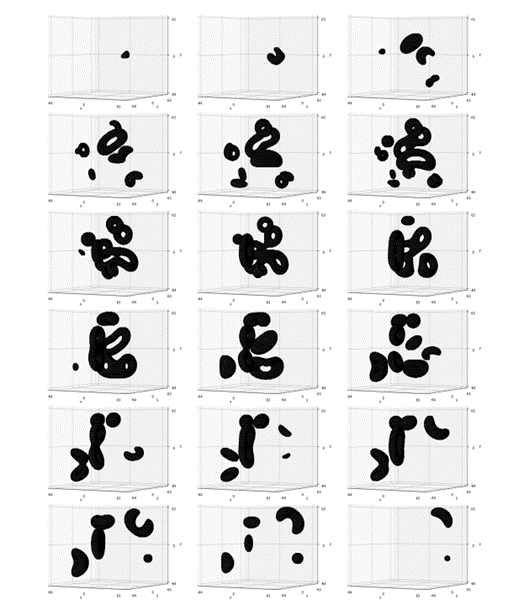
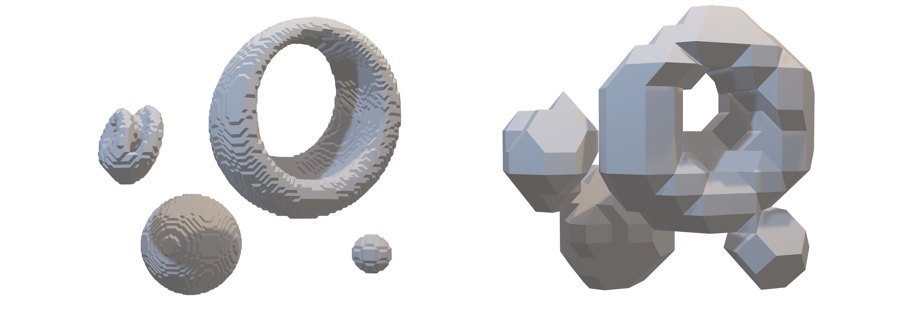
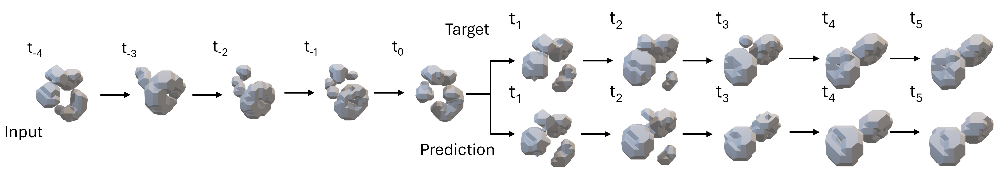
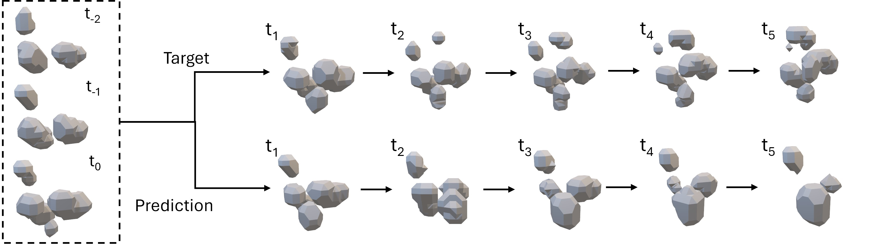

3D Spatio-Temporal (4D) Predictions with ConvLSTM and GAN models
=====================================
This is the code for reproducing experiments from the master's thesis ["3D Spatio-Temporal Predictions with ConvLSTM and GAN models"]("thesis/Thesis_3DSpatioTemporalPredictions.pdf") written at FH Technikum Vienna.

## Overview
__Abstract__ 
*Forecasting video frames is a research topic for several years, where the general idea is to
use a set of video frames of the past and to predict the next event(s) that will happen in the
scene. Although a lot of publications are available and advances in this field have been made,
barely anything can be found on the topic of next frame predictions of 3D data, like the state
or topology change over time of objects. Applications for such models obviously exist, like
time-dependent physical simulations, Magnet Resonance Imaging, CT-scans, to name a few.
Therefore, in this work the two most commonly used approaches, ConvLSTM and GAN-based
networks, are trained and tested upon their applicability on 3D spatio-temporal predictions of
topological changes. The artificially generated academic dataset that is used, represents developing
cavities within a confined 3D grid space over time. The models are evaluated by means of
single next frame prediction and long-term predictive performance utilizing the Jaccard Distance
as a quality measure. Additionally, three different dataset formats are evaluated, representing
smaller and larger frame to frame transitions. The results show that larger frame steps didn’t
produced an obstacle for the models, but have even encouraged learning the transition from
one frame to the next in both. Out of the two approaches and setups tested, the ConvLSTM
model showed the best performance overall. This work shows that the 2D approaches are
applicable to the 3D space and delivers insights on how many future frames can be predicted
with an acceptable confidence, based on the two modelling approaches and the dataset under
consideration.*

__Dataset__ 
The dataset used in all trainings is the dataset from ["Topology Estimation of Simulated 4D Image Data by Combining Downscaling and Convolutional Neural Networks"](https://arxiv.org/abs/2306.14442) with a total of 32000 3D objects
of a size of 128x128x128 over a time of 128 time-points. The objects are a random number of
combinations of ball and tori shape variations, generated by parameterized analytical equations
of varying complexity to represent different orientations and volume over time. 

  
   
  <em>Cavities within a 128x128x128x128 sample, 18 equally-spaced 3D slices along the time-axis
from left to right and top to bottom from "Topology Estimation of Simulated 4D Image Data by Combining Downscaling and Convolutional Neural Networks"(https://arxiv.org/abs/2306.14442)</em>
   

All the data has been converted into the TFrecords format to allow reading the data in
the most efficient format when needed and pre-loading (prefetching) data during training for the
next loop, because the dataset is too large to keep all of it in memory during training. 
Since a grid-based approach is chosen for building the ConvLSTM and GAN models, the
neural network gets big pretty fast due to the operations within the layers, especially due to convolutional
layers and their corresponding number of filters. A reasonable compromise needed
to be found between an object resolution still covering differences of relevant features and the
training time on a single GPU setup. Therefore, all the 32000 data-points were converted from
128x128x128x128 to the size per sample of 128x16x16x16 and split into training-, validation- and
testing sets (80%, 10%, 10% split).
The downscaled TFrecords datasets can be found in [data]("data"). Each datapoint is in the format of 128x16x16x16 (128 time points of a 3D object with the resolution of 16³).

  
   
  <em>Downscaled resolution from originally 128³ to 16³</em>
   

## Prerequisites

- Python, NumPy, TensorFlow 2.10, SciPy, Matplotlib
- NVIDIA GPU

## Models

The code for all the models can be found in [code]("code").  
- [AEncGAN3D]("code/01_AEncGAN3D"): GAN-based models (single frame input, 3 prev. frames input)
- [ConvLSTM3D]("code/02_ConvLSTM3D"): ConvLSTM model
- [Trained Models]("code/99_FINAL_MODELS_FOR_THESIS"): All trained models used in the thesis, incl. post processing scripts

For more details please look into ["3D Spatio-Temporal Predictions with ConvLSTM and GAN models"]("thesis/Thesis_3DSpatioTemporalPredictions.pdf")

## Prediction Examples

  
   
  <em>ConvLSTM Model - Exemplary generated long-term predictions</em>
   

  
   
  <em>GAN-based Model - Exemplary generated long-term predictions</em>
   

## Acknowledgements
This code borrows from
+ [Next-Frame Video Prediction with Convolutional LSTMs](https://keras.io/examples/vision/conv_lstm/)
+ [Improved Training of Wasserstein GANs](https://github.com/igul222/improved_wgan_training)
+ [Motionganvae](https://github.com/tkarras/progressive_growing_of_gans)
